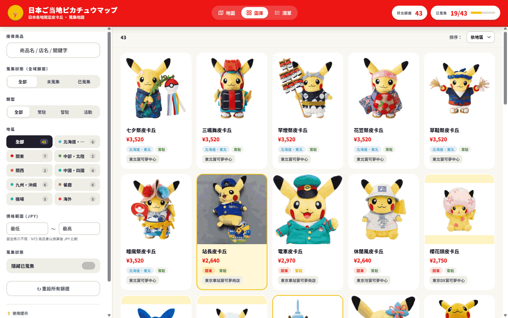
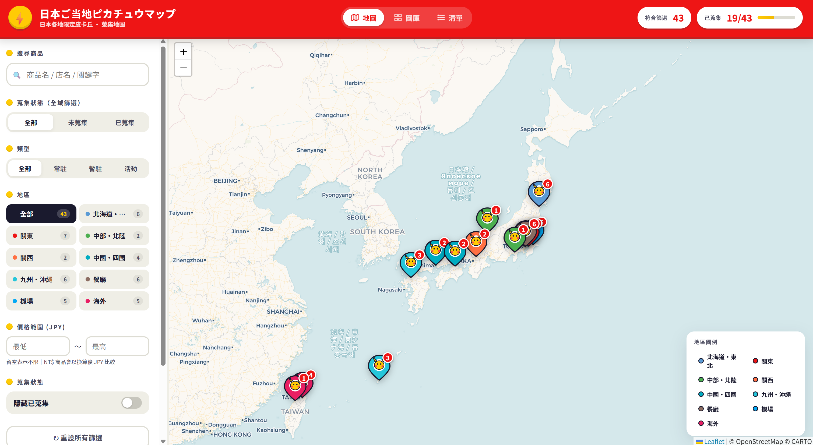
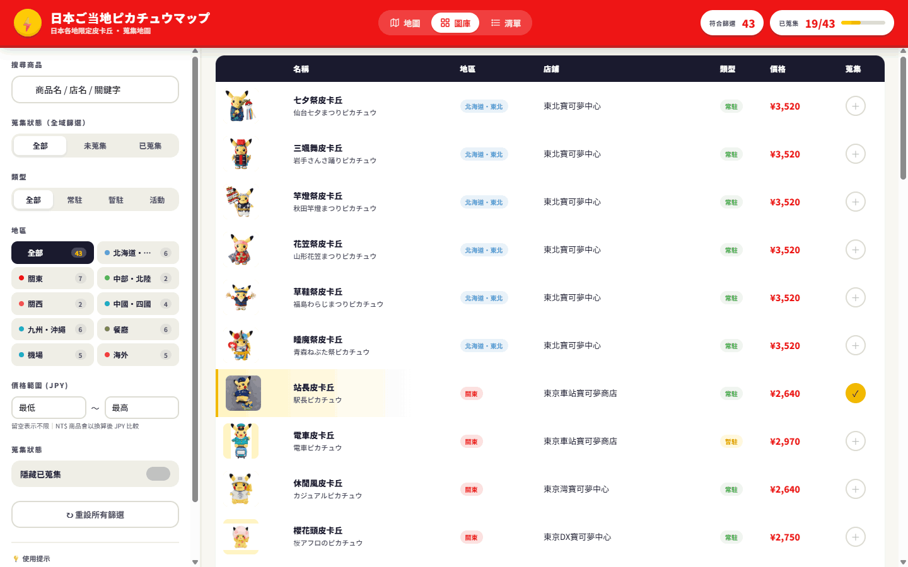

# 日本ご当地ピカチュウマップ 🗾⚡

> **日本各地寶可夢中心限定皮卡丘絨毛娃娃** — 互動地圖、圖庫、清單 + 蒐集追蹤

🌐 **線上展示** ➤ <https://kerong2002.github.io/gotochi-pikachu-map/>
📦 **原始碼** ➤ <https://github.com/kerong2002/gotochi-pikachu-map>

---

## 📸 預覽

### 🖼️ 圖庫瀏覽模式
高解析度卡片網格，一覽所有皮卡丘的造型、價格與地區


### 🗺️ 地圖模式
互動式日本地圖，標記顯示每家店鋪的限定款數量


### 📋 清單模式
緊湊資料表格，支援欄位排序，最適合快速比對


---

## ✨ 功能

- 🗺️ **三種顯示模式** — 地圖 / 圖庫 / 清單，自由切換
- 🔍 **多重篩選** — 搜尋、地區、類型（常駐 / 暫駐 / 活動）、價格範圍、蒐集狀態
- ✅ **蒐集追蹤** — 點一下「標記蒐集」，自動存在瀏覽器 localStorage，重整不會掉
- 📊 **進度顯示** — 即時統計符合篩選的數量 / 已蒐集進度條
- 📍 **店鋪詳情** — 點任何商品或地圖標記，側邊面板顯示完整資料 + Google Maps 連結
- 📱 **響應式設計** — 手機、平板、桌面都好用

## 📦 資料統計

- **43 款** 限定皮卡丘
- **16 個** 販售地點（寶可夢中心 / 商店 / 咖啡廳 / 機場 / 海外）
- **9 個** 分類區域：北海道・東北、關東、中部・北陸、關西、中國・四國、九州・沖繩、餐廳、機場、海外

## 🚀 部署到 GitHub Pages

1. 把整個資料夾推到 GitHub repo
2. 進入 repo 的 **Settings → Pages**
3. Source 選 `Deploy from a branch`
4. Branch 選 `main` + `/(root)`，按 Save
5. 等待 1～2 分鐘，網頁就會在 `https://你的帳號.github.io/你的repo名/` 上線

## 🗂️ 檔案結構

```
.
├── index.html          主頁面
├── css/
│   └── styles.css      樣式（寶可夢紅黃配色）
├── js/
│   ├── data.js         店鋪 + 皮卡丘商品資料
│   └── app.js          地圖邏輯、篩選、蒐集追蹤
├── images/             商品圖片（image-0.png ~ image-40.png 等）
├── preview/            README 預覽截圖
└── README.md
```

## ✏️ 修改 / 新增商品

打開 `js/data.js`：

- `STORES` 陣列：店鋪資料（id、地區、名稱、地址、經緯度、Google Maps 連結）
- `PLUSHES` 陣列：商品資料（id、storeId、日文名、中文名、價格、類型、圖片路徑、是否已蒐集）

新增商品時：
1. 把官方圖放到 `images/`（建議 400×400 PNG，白底或透明）
2. 在 `PLUSHES` 加一筆，`image` 欄位指到該圖
3. 設 `collected: true` 會讓首次載入時自動匯入到本機蒐集清單

## 🔄 重置蒐集進度

在瀏覽器 console 執行：
```js
Object.keys(localStorage).filter(k => k.startsWith('pika-map')).forEach(k => localStorage.removeItem(k));
location.reload();
```

## 📋 技術細節

- **地圖：** Leaflet + CartoDB Voyager 圖磚（免 API key）
- **儲存：** localStorage（key prefix: `pika-map-`）
- **無需後端、無需 build step**，純靜態網頁，GitHub Pages 即可部署

## ⚠️ 免責

商品圖片版權屬於 **©Nintendo / Creatures Inc. / GAME FREAK Inc. / The Pokémon Company**。
本網頁僅作為玩家蒐集記錄之用，不販售任何商品、不代表官方。

實際販售狀況、價格與庫存可能隨時變動，最新資訊請以 [寶可夢官方店舖頁](https://www.pokemon.co.jp/shop/) 為準。

---

Made with ⚡ for Pokémon fans
